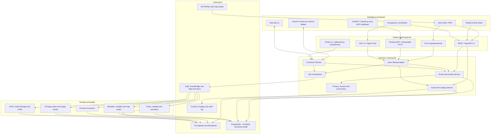

# Jotos agenttisena GPS-ekosysteeminä

Tilannekuva ja suositus 20.6.2026. Tämä dokumentti laajentaa Jotoksen yksittäisen GPX-animaattorin avoimeksi GPS-aineistojen käsittely-, julkaisu- ja mediapalveluksi.

## Tiivistelmä

Jotoksen paras positio ei ole uusi Strava, AllTrails tai Intervals.icu. Se on niiden väliin ja rinnalle sijoittuva, käyttäjän omistamaan dataan perustuva **GPS media and interoperability layer**:

- tuo GPX-, FIT-, TCX-, KML-, GeoJSON- ja myöhemmin muita paikkatietoformaatteja;
- normalisoi, validoi, rikastaa, suojaa ja versioi reittidatan;
- muuntaa reitin tiedostoiksi, kartoiksi, videoiksi ja jaettaviksi aineistopaketeiksi;
- tarjoaa samat kyvykkyydet web-käyttöliittymälle, avoimelle REST API:lle ja MCP-työkaluina;
- delegoi pitkäkestoisia töitä muille agenteille A2A:n kautta;
- yhdistyy Garmin Connectiin hyväksytyn kumppaniohjelman kautta ja Intervals.icu:un OAuth 2.0:lla;
- säilyttää yksityisyyden, lisenssin, alkuperän ja Garmin-attribuution jokaisessa johdannaisessa tiedostossa.

Suositus on rakentaa ensin deterministinen GPS-alusta ja sen päälle ohut agenttikerros. LLM ei saa parsia GPX:ää, laskea geometriaa, leikata yksityisyysvyöhykkeitä tai renderöidä videota itse. Se valitsee ja orkestroi testattavia työkaluja.

## Arkkitehtuurikuva

Arkkitehtuurin tärkein raja on MCP/A2A/AG-UI-kerroksen ja sovellusytimen välissä. Kaikki rajapinnat kutsuvat samoja domain-palveluja. Agentille ei anneta suoraa tietokanta- tai S3-oikeutta.

## Canonical GPS -tietomalli

Alkuperäinen tiedosto säilytetään muuttumattomana S3:ssa. Sen rinnalle muodostetaan versioitu canonical-malli:

- `Asset`: alkuperäinen tai johdannainen tiedosto, SHA-256, MIME-tyyppi, koko ja omistaja;
- `Activity`: tapahtunut suoritus, jolla voi olla aika-, syke-, teho- ja anturidataa;
- `Route`: suunniteltu tai aktiviteetista johdettu geometria;
- `TrackSegment`: katkeamaton ajan ja sijainnin sarja;
- `TrackPoint`: WGS84-sijainti, aika, korkeus ja valinnaiset sensorikanavat;
- `Waypoint`: nimetty piste ja semanttinen tyyppi;
- `Media`: kuva, video, thumbnail tai läpinäkyvä overlay;
- `Transformation`: parseri, parametrit, ohjelmistoversio, inputit ja outputit;
- `LicenseAndProvenance`: lähde, lisenssi, käyttöehdot, attribuutio ja suostumus;
- `PrivacyPolicy`: alku-/loppuleikkaus, kotivyöhyke, näkyvyys ja jakelurajat;
- `ExternalIdentity`: Garmin-, Intervals.icu-, Strava- tai muun palvelun tunniste ilman että ulkoinen ID on Jotoksen pääavain.

PostGIS on canonical geometrian totuuslähde. S3 on tiedostojen totuuslähde. GeoJSON on API-vaihtoformaatti, mutta suurissa analyyttisissä aineistoissa käytetään GeoParquetia. PMTiles on karttatiilien jakelumuoto, ei reittitietokanta.

## Suositeltu AWS-toteutus

### Ensimmäinen tuotantoversio

- nykyinen Vite/MapLibre PWA S3 + CloudFront -jakelussa;
- TypeScript API Lambda-funktioina API Gatewayn takana;
- Cognito tai erillinen OIDC-palvelu käyttäjille ja OAuth 2.1 -valtuutuksille;
- S3 alkuperäisille tiedostoille, johdannaisille, PMTiles-paketeille ja videoille;
- PostgreSQL 16 + PostGIS reiteille, pisteille, hakuindekseille ja lineage-metadatalle;
- SQS + EventBridge + Step Functions asynkronisille töille;
- ECS Fargate -workerit FFmpeg-, GPSBabel-, GDAL- ja 4K-renderöinneille;
- Lambda kevyille parseri-, validointi- ja webhook-töille;
- CloudFrontin allekirjoitetut URL:t yksityisille latauksille;
- KMS, Secrets Manager, CloudWatch ja OpenTelemetry auditointiin.

Videoita ei pidä renderöidä Lambda-funktiossa: pitkät 4K-työt, fontit, kartta-aineistot ja FFmpeg sopivat paremmin kertakäyttöiseen Fargate-tehtävään. Selainrenderöinti voidaan säilyttää ilmaisena nopeana esikatseluna.

### Skaalaus

Kun jatkuvaa MCP/AG-UI-streamausta tarvitaan paljon, API- ja agenttigateway siirretään Lambda-mallista ECS Fargateen tai App Runneriin. PostGIS voidaan aloittaa yhdellä pienellä RDS-instanssilla ja nostaa Multi-AZ:ksi vasta maksavien asiakkaiden SLA-vaatimuksesta.

## Agenttinen toimintamalli

Jotos tarvitsee yhden käyttäjälle näkyvän agentin ja rajattuja sisäisiä kyvykkyyksiä, ei vapaasti keskustelevien agenttien parvea.

### Jotos Steward Agent

Vastaa käyttäjän tavoitteesta, näyttää suunnitelman, pyytää tarvittavat hyväksynnät ja seuraa jobien valmistumista. Esimerkki:

> “Tuo viikonlopun Garmin-aktiviteetti, piilota 800 metriä alusta ja lopusta, tee 30 sekunnin WhatsApp-video MML Maasto -kartalla ja lähetä valmis reitti Intervals.icu:un.”

Agentti suorittaa tämän auditoitavana työnkulkuna:

1. `list_connector_activities`
2. käyttäjän valinta ja suostumus
3. `import_activity`
4. `analyze_privacy_risk`
5. käyttäjän hyväksymä `apply_privacy_policy`
6. `create_video_job`
7. `get_job` / MCP Task
8. `publish_to_intervals`
9. allekirjoitetun jakolinkin palautus

### Rajatut kyvykkyysagentit

- **Intake**: tunnistaa formaatin, validointituloksen ja tarvittavan parserin;
- **Privacy steward**: ehdottaa peittoa ja kertoo mitä dataa julkaistaan, mutta ei muuta näkyvyyttä ilman hyväksyntää;
- **Route producer**: kokoaa kartta-, tyyli-, nopeus- ja videopresetin;
- **Connector steward**: hoitaa Garmin/Intervals/Strava OAuth-scopejen ja attribuution;
- **Rights steward**: tarkistaa lähteen, lisenssin, attribuution ja johdannaisen jakeluoikeuden;
- **Catalog steward**: tuottaa STAC-, Data Package- ja hakumetadatan.

Nämä ovat aluksi orkestrointirooleja samassa palvelussa. Ne kannattaa erottaa A2A-palveluiksi vasta, jos ne omistaa eri tiimi tai organisaatio.

## MCP-palvelu

MCP on Jotoksen ensisijainen agentti–työkalu- ja agentti–data-rajapinta. Julkinen palvelin käyttää Streamable HTTP -transporttia osoitteessa `/mcp`; nykyinen MCP korvaa vanhan erillisen HTTP+SSE-mallin Streamable HTTP:llä ([MCP transport specification](https://modelcontextprotocol.io/specification/2025-06-18/basic/transports)).

### Resources

- `jotos://activities/{id}`
- `jotos://routes/{id}`
- `jotos://assets/{id}`
- `jotos://jobs/{id}`
- `jotos://catalog/collections/{id}`
- `jotos://licenses/{id}`
- `jotos://connectors/{provider}/status`

Resource palauttaa tiiviin metadatan ja allekirjoitetun asset-linkin; suurta GPX/FIT/MP4-binaaria ei työnnetä mallin kontekstiin.

### Read tools

- `inspect_gps_file`
- `get_route_summary`
- `search_routes`
- `compare_routes`
- `get_elevation_profile`
- `list_supported_formats`
- `get_job`
- `list_connector_activities`

### Write tools

- `import_asset`
- `convert_route_format`
- `apply_privacy_policy`
- `create_video_job`
- `cancel_job`
- `publish_route`
- `export_to_garmin`
- `publish_to_intervals`
- `create_share_link`

Kirjoittavat työkalut ovat idempotentteja ja käyttävät `idempotency_key`-kenttää. Julkaisu, ulkoiseen palveluun kirjoitus, yksityisyysasetuksen heikennys ja maksullinen renderöinti vaativat eksplisiittisen vahvistuksen.

MCP:n 2025-11-25-versio sisältää pitkäkestoisille töille `tasks/get`, `tasks/result`, `tasks/list` ja `tasks/cancel` -mallin ([MCP Tasks](https://modelcontextprotocol.io/specification/2025-11-25/basic/utilities/tasks)). Jotoksen oma job on silti sisäinen totuuslähde; MCP Task on sen protokollasovitin.

### MCP-turvallisuus

- OAuth 2.1 + PKCE, audience-rajoitetut tokenit ja pienet scopet;
- erilliset scopet kuten `routes:read`, `assets:write`, `video:create`, `connectors:garmin`, `publish:external`;
- ei Garmin- tai Intervals-tokenin passthrough'ta MCP-asiakkaalta;
- palvelu säilyttää ulkoiset refresh tokenit KMS-salattuina;
- jokainen write-tool tuottaa audit-eventin;
- URL-tuonnissa egress allowlist, yksityisverkkojen esto ja kokorajat SSRF-riskin vuoksi;
- työkalujen tulokset käsitellään epäluotettavana datana, ei agenttiohjeina.

Virallinen MCP-ohjeistus kieltää token passthrough -mallin ja korostaa per-client-suostumusta, scopejen minimointia sekä SSRF-suojausta ([MCP Security Best Practices](https://modelcontextprotocol.io/specification/2025-06-18/basic/security_best_practices)).

## A2A ja AG-UI

**A2A 1.0** on sopiva kumppanien agenttien kanssa tehtäviin pitkäkestoisiin delegointeihin: “renderöi tämä aineisto”, “rikasta tämä korkeusmallilla” tai “julkaise tämä tapahtumajärjestelmässä”. Se tarjoaa Agent Cardin, task-elinkaaren, artifactit ja streamingin. A2A:n nykyinen julkaistu pääversio on 1.0.0 ([virallinen A2A-specifikaatio](https://github.com/a2aproject/A2A/blob/main/docs/specification.md)).

**AG-UI** sopii Jotoksen web-käyttöliittymän ja Steward Agentin väliin. Sen state snapshot/delta- ja tool event -mallilla käyttäjä näkee importin, privacy preview'n ja renderöinnin etenemisen ilman omaa WebSocket-protokollaa ([AG-UI overview](https://docs.ag-ui.com/), [event model](https://docs.ag-ui.com/concepts/events)).

A2A ei korvaa MCP:tä:

- MCP: agentti käyttää työkalua tai resurssia;
- A2A: toinen itsenäinen agentti ottaa vastuulleen tehtävän;
- AG-UI: agentin tila ja hyväksyntäpyynnöt välitetään käyttäjän käyttöliittymään.

## Muut standardit

| Standardi | Käyttö Jotoksessa | Päätös |
|---|---|---|
| OpenAPI 3.1 | Julkinen ja kumppanien REST API | Ydin |
| OAuth 2.1 / OIDC / PKCE | Käyttäjät ja delegoitu connector-oikeus | Ydin |
| CloudEvents | Webhookien ja sisäisten eventtien yhteinen envelope | Ydin |
| OGC API Features | Reittien, waypointien ja alueiden standardihaku | Ydin vaiheessa 2 |
| OGC API Processes | Muunnos- ja renderöintijobien standardipinta | Hyvä B2B-laajennus |
| STAC | Tiedostojen, karttojen, videoiden ja johdannaisten katalogi | Ydin metadatassa |
| GeoJSON / GeoParquet | API-geometria / suuret aineistot | Ydin |
| PMTiles | Offline- ja staattinen karttajakelu | Ydin |
| Data Package + DCAT 3 | Avoimien reittikokoelmien metadata | Julkiset datasetit |
| W3C PROV / lineage | Muunnosketju ja alkuperä | Sisäinen + export |
| C2PA 2.3 | Generoidun videon alkuperä ja muokkaushistoria | Vaihe 3 |
| ActivityPub | Julkisten reittien federointi | Kokeilu myöhemmin |
| Web Share API | WhatsApp/Telegram/native share | Web/PWA |
| UCP | Opastukset, tapahtumat, tulostekartat ja muut tuotteet | Ei ydintä |
| AP2 | Agentin maksut ja todennettava valtuutus | Vasta kaupankäynnissä |

OGC API Features standardoi paikkatietokohteiden haun ja OGC API Processes asynkronisten paikkatietoprosessien/jobien mallin ([OGC Features](https://ogcapi.ogc.org/features/), [OGC Processes](https://ogcapi.ogc.org/processes/)). STAC kuvaa spatiotemporaalisen assetin GeoJSON Itemina, jolla on aika, geometria, linkit ja fyysiset assetit ([STAC](https://stacspec.org/)). CloudEvents on CNCF:n valmistunut event-envelope-standardi ([CloudEvents](https://cloudevents.io/)). C2PA 2.3 tarjoaa videoille koneellisesti todennettavan provenance-ketjun ([C2PA 2.3](https://spec.c2pa.org/specifications/specifications/2.3/specs/_attachments/C2PA_Specification.pdf)).

UCP on Google/Shopify-vetoinen agenttikaupan standardi, ei GPS-dataprotokolla ([Shopifyn UCP-arkkitehtuuri](https://shopify.engineering/UCP), [Google UCP](https://developers.google.com/merchant/ucp)). Sitä ei pidä lisätä ennen kuin Jotos myy varattavia oppaita, tapahtumapaikkoja, karttapaketteja tai painotuotteita. AP2 on maksujen todennettava valtuutuskerros, jonka Google lahjoitti FIDO Alliancelle huhtikuussa 2026 ([AP2/FIDO](https://blog.google/products-and-platforms/platforms/google-pay/agent-payments-protocol-fido-alliance/)).

## Garmin Connect -integraatio

Garmin tarjoaa liiketoimintakäyttöön pilvi–pilvi Developer Programin. Activity API antaa FIT-, GPX- ja TCX-aktiviteettitiedostot push- tai pull-mallilla, ja Courses API vie Jotoksessa tehdyn reitin Garmin Connectiin sekä yhteensopivaan laitteeseen ([Activity API](https://developer.garmin.com/gc-developer-program/activity-api/), [Developer Program overview](https://developer.garmin.com/gc-developer-program/overview/)).

Suositeltu flow:

1. Jotos hakee Garmin Developer Program -hyväksynnän yritys-/liiketoimintakäyttöön.
2. Käyttäjä yhdistää Garminin OAuth 2.0:lla ja valitsee erilliset import/export-oikeudet.
3. Garminin push ilmoittaa uudesta aktiviteetista; webhook vastaa nopeasti ja siirtää työn SQS:ään.
4. Jotos hakee FIT-tiedoston ja säilyttää Garminin external ID:n, laitteen mallin ja attribuution.
5. Käyttäjä voi tehdä videon, yksityisyysversion tai reittijohdannaisen.
6. Jotoksen Route voidaan julkaista takaisin Garminiin Courses API:lla.

Garminin ohjelma on hyväksytyille yrityksille ilman normaalia lisenssi- tai ylläpitomaksua, mutta vain business use -käyttöön; jotkin metriikat voivat vaatia maksun. Garmin ilmoittaa tyypilliseksi integraatioajaksi 1–4 viikkoa ([Program FAQ](https://developer.garmin.com/gc-developer-program/program-faq/)).

Kriittinen vaatimus: Garmin-lähtöinen data on attribuoitava myös johdannaisissa API-, webhook-, tiedosto-, kartta-, video- ja somejulkaisuissa. Videopohjaan tarvitaan esimerkiksi `Data source: Garmin [device model]` ([Garmin API Brand Guidelines](https://developer.garmin.com/brand-guidelines/api-brand-guidelines/)).

Connect IQ -sovellus on erillinen myöhempi polku. Sen avulla Jotos voi tarjota kellossa reitin avauksen, live-tilan tai Jotos-share-koodin, mutta pilvisynkronoinnin ensimmäinen ratkaisu on Activity + Courses API.

## Intervals.icu -integraatio

Intervals.icu on Jotokselle poikkeuksellisen hyvä kumppani, koska sillä on REST API, OAuth 2.0 granular scopes, webhooks, external ID -tuki sekä FIT/TCX/GPX/ZIP/GZ upload/download ([Intervals.icu Open API](https://www.intervals.icu/features/open-api/), [API docs](https://www.intervals.icu/api-docs.html)). Yli 200 kolmannen osapuolen sovellusta käyttää rajapintaa palvelun oman ilmoituksen mukaan.

Jotoksen kannattaa tarjota:

- “Import latest activity from Intervals.icu”;
- “Create route/video from selected activity”;
- videolinkin ja Jotos-asset-ID:n kirjoitus aktiviteetin metadataan, jos API sallii kentän;
- Jotoksen GPX/FIT-johdannaisen upload external ID:llä, jotta duplikaatit estetään;
- webhook-triggeröity automaattinen videotyö käyttäjän säännöllä;
- suunnitellun reitin tai workoutiin liittyvän course-assetin vienti ilman että Jotos yrittää korvata Intervals.icu:n analytiikkaa.

Integraatio aloitetaan käyttäjän henkilökohtaisella API-avaimella vain kehityksessä. Tuotannossa käytetään OAuth 2.0:aa, minimiscopeja, webhookeja ja external ID -idempotenssia. Olemassa oleva avoin [Intervals MCP Server](https://github.com/mvilanova/intervals-mcp-server) kannattaa käyttää rajapinnan käyttäytymisen referenssinä; Jotos ei tarvitse sen forkkausta, koska oma MCP-palvelu yhdistää Intervals-datan Jotoksen assetteihin ja jobeihin.

## Avoimen lähdekoodin reuse-kartta

| Projekti | Mitä se jo ratkaisee | Jotoksen päätös |
|---|---|---|
| [MapLibre GL JS](https://github.com/maplibre/maplibre-gl-js) | WebGL-karttarenderöinti | Käytössä, pidetään |
| [PMTiles](https://github.com/protomaps/PMTiles) | Yhden tiedoston karttatiilet staattisessa tallennuksessa | Käytössä offline-/S3-jakeluun |
| [gpx.studio](https://github.com/gpxstudio/gpx.studio) | GPX-luonti, editointi ja TypeScript GPX -kirjasto | Arvioi parserin/editorin reuse MIT-lisenssillä |
| [toGeoJSON](https://github.com/placemark/togeojson) | GPX/KML/TCX -> GeoJSON TypeScriptissä | Käytä kevyissä web- ja API-muunnoksissa |
| [GPSBabel](https://github.com/GPSBabel/gpsbabel) | Laaja GPS-formaattien muunnos ja suodatus | Eristetty GPL-2.0 worker, ei omaa formaattiviidakkoa |
| [GPXSee](https://github.com/tumic0/GPXSee) | Erittäin laaja formaatti- ja karttayhteensopivuus | Käytä testikorpuksen ja formaattituen vertailukohtana |
| [GPX Animator](https://github.com/gpx-animator/gpx-animator) | GPX -> MP4, CLI ja top-down-karttavideo | Benchmark ja fallback-worker; Jotoksen pilvi-/somepipeline on oma erottautuja |
| [FitTrackee](https://github.com/SamR1/FitTrackee) | Self-hosted outdoor activity tracker | Tutki domain-malli ja API; älä rakenna sen activity feediä uudelleen |
| [OpenTracks](https://github.com/opentracksapp/opentracks) | Android GPS-tallennus, yksityisyys ja GPX/KML export | Kumppanuus/share-target mieluummin kuin oma recorder ensin |
| [Valhalla](https://github.com/valhalla/valhalla) | OSM-pohjainen multimodaalinen reititys ja map matching | Käytä myöhemmin reititykseen/map matchiin |
| [GoldenCheetah](https://github.com/GoldenCheetah/GoldenCheetah) | Syvä harjoitus- ja suoritusanalytiikka | Ei rakenneta vastaavaa analytiikkaa |
| [Intervals MCP Server](https://github.com/mvilanova/intervals-mcp-server) | MCP-työkalut Intervals.icu-datalle | Referenssi, ei Jotoksen ydinkoodi |

Lisenssit tarkistetaan komponenttikohtaisesti SBOM:ssa. GPL-ohjelmat kannattaa suorittaa erillisinä prosesseina/kontteina ja julkaista tehdyt muutokset lisenssin vaatimusten mukaisesti. Garmin FIT SDK:n käyttöehdot tarkistetaan erikseen ennen palvelinjakelua.

## Kilpailukenttä

| Toimija | Vahvuus | Jotoksen ei pidä kopioida | Jotoksen mahdollisuus |
|---|---|---|---|
| AllTrails | Reittikatalogi, offline, navigointi, wrong-turn alerts | Massiivinen kuluttajareittikatalogi | Avoin data, provenance ja formaattivapaus |
| Strava | Sosiaalinen verkko, aktiviteetit, segmentit, API/webhooks | Feed, kudos ja suoritusvertailu | Käyttäjän omistama johdannais- ja media-API |
| Komoot | Reittisuunnittelu, offline-kartat, laitesynkronointi | Täysi turn-by-turn-navigointi alussa | Avoimet karttapaketit ja agenttinen reittiputki |
| Relive | Helppo 3D-aktiviteettivideo kuvilla ja musiikilla | Kuluttajavideon kaikki efektit kerralla | API-first, batch, 4K/master, läpinäkyvät overlayt ja B2B |
| Intervals.icu | Harjoitusanalytiikka, kalenteri, wellness, valmennus | CTL/ATL/tehoanalytiikka | Media-, route-, privacy- ja format companion |
| Garmin Connect | Laite-ekosysteemi ja datan lähde | Laitepilvi | Activity import + Course export + attribuoitu media |
| GPX Studio | Erinomainen ilmainen GPX-editori | Oma editorimoottori tyhjästä | Agenttityökalut, backend, media ja integraatiot |
| FitTrackee | Avoin self-hosted activity tracker | Yleinen activity tracker | Federated asset/processing layer |
| GPX Animator | Avoin top-down-videogeneraattori | Perus GPX->MP4 CLI | Pilvipalvelu, presetit, MCP/API ja sosiaalijakelu |

AllTrailsin 2026 premium sisältää offline-alueet, custom routes ja wrong-turn alerts ([AllTrails tiers](https://support.alltrails.com/hc/en-us/articles/37200882853140-The-benefits-of-AllTrails-premium-membership)). Komoot myy offline-kartta-alueita ja Premium-ominaisuuksia ([Komoot plans](https://support.komoot.com/hc/en-us/articles/360034377771-Komoot-Premium-vs-the-World-Pack)). Relive tekee aktiviteetista automaattisen 3D-videon kuvilla, videoilla ja musiikilla ([Relive](https://www.relive.com/explore)). Strava tarjoaa OAuth/API/webhookit, mutta sovelluksen on noudatettava aktiviteettien privacy-muutoksia ([Strava webhooks](https://developers.strava.com/docs/webhooks/)).

## Kaupallistamispotentiaali

Markkinasta on riittävä näyttö kapeallekin integraatio- ja mediatuotteelle. Intervals.icu ilmoittaa kesäkuussa 2026 yli 160 000 aktiivista urheilijaa ja 193 miljoonaa analysoitua aktiviteettia sekä yli 200 API-integraatiota ([Intervals.icu](https://www.intervals.icu/)). Garmin kertoo kymmenistä miljoonista käytössä olevista kelloista, 20 miljoonasta vuonna 2025 toimitetusta laitteesta ja Garmin Connect -aktiviteettien 8 prosentin vuosikasvusta ([Garmin 2025 data report](https://www.garmin.com/en-US/blog/general/2025-garmin-connect-data-report/), [Garmin FY2025](https://www.garmin.com/en-US/newsroom/wp-content/uploads/2026/02/2025_Q4_Earnings_Press_Release.pdf)). Tämä ei todista Jotoksen kysyntää sellaisenaan, mutta osoittaa suuren jatkuvan GPS-aktiviteettivirran ja valmiuden kolmannen osapuolen integraatioihin.

Hinnoitteluhypoteesi on linjassa lähimarkkinan kanssa: Intervals.icu Supporter maksaa 4 USD/kk ja Garmin Connect+ 6,99 USD/kk ([Intervals.icu pricing](https://www.intervals.icu/), [Garmin Connect+](https://www.garmin.com/en-US/newsroom/press-release/wearables-health/elevate-your-health-and-fitness-goals-with-garmin-connect/)). Jotoksen on silti validoitava maksuhalukkuus renderöintikustannusta ja automaatiota vastaan ennen lopullista hinnoittelua.

### Avoin ilmainen ydin

- paikallinen GPX/TCX/KML/GeoJSON-tuonti ja editointi;
- yksityisyysleikkaus ja perus-MP4 selaimessa;
- avoimen reitin katselu, lataus ja attribuutio;
- self-hostattava community edition;
- rajattu henkilökohtainen MCP read -pinta.

### Pro, noin 6–12 euroa kuukaudessa testattavaksi

- pilvirenderöinti ilman selaimen teho- ja muistirajoja;
- 4K/master, batch-renderöinti, omat tyylit ja tallennetut presetit;
- automaattiset Garmin/Intervals webhook -työnkulut;
- pidempi asset-säilytys ja yksityiset jakolinkit;
- C2PA/provenance ja tuotantotyökaluihin sopivat overlay-exportit.

### Club / Event / Creator, noin 29–199 euroa kuukaudessa

- tiimikirjasto, roolit, brändipohjat ja hyväksyntäworkflow;
- kilpailu- tai retkitapahtuman kymmenien/satojen videoiden batch;
- reittikokoelmat, QR-share ja embed player;
- white-label domain ja SLA;
- API- ja webhook-kiintiöt.

### B2B API

- maksu renderöintiminuutista, 4K-jobista tai tallennetusta gigatavusta;
- reittiformaattien muunnos ja privacy-safe derivative API;
- matkailutoimijoiden, tapahtumajärjestäjien, valmennusalustojen ja kameravalmistajien integraatiot;
- MCP-työkalupalvelu agenteille käyttökiintiöllä.

### Marketplace myöhemmin

UCP/AP2 voi palvella opastettujen retkien, kilpailupaikkojen, painettujen karttojen, premium-karttapakettien tai kuvauspalvelujen myyntiä. Julkinen reittidata ja käyttäjän omien tiedostojen vienti eivät saa muuttua commerce-protokollasta riippuvaisiksi.

Jotos ei myy sijainti-, terveys- tai harjoitusdataa. Luottamus, avoin export ja yksityisyys ovat tuotteen kaupallinen puolustus, eivät ilmaisversion rajoite.

## Kumppanuudet

Ensimmäinen kumppanuusjärjestys:

1. **Intervals.icu**: teknisesti nopein OAuth/webhook/API-pilotti ja yhteinen “activity to media” -käyttötapaus.
2. **Garmin Developer Program**: business-hakemus Activity + Courses API:lle, selkeä demo ja attribuutiomalli.
3. **Suomen Latu, Metsähallitus, kunnat ja matkailualueet**: avoimet/viralliset reitit, reittien versionhallinta ja saavutettavuus.
4. **Tapahtumajärjestäjät**: automaattiset osallistuja- ja reittivideot sekä sponsoripohjat.
5. **OpenTracks, FitTrackee ja GPX Studio -yhteisöt**: share-targetit, yhteensopivuustestit ja yhteiset formaattikorjaukset.
6. **Action camera / drone / editor ecosystem**: telemetria-overlayt, GoPro/DJI-aikasynkronointi ja Final Cut / DaVinci -masterit.
7. **Kartta- ja elevation-toimijat**: MML, OSM, Protomaps ja avoimet DEM/STAC-katalogit.

## Tietoturva ja yksityisyys

- yksityinen oletus kaikelle käyttäjän aktiviteettidatalle;
- tarkka sijainti ja toistuvat koti-/työkuviot luokitellaan arkaluonteiseksi dataksi;
- privacy preview ennen julkaisua ja ennen jokaista ulkoista connector-writea;
- alkuperäinen ja julkinen johdannainen eri assetteina ja eri käyttöoikeuksilla;
- deletion tombstone välitetään connector- ja share-johdannaisiin;
- webhook-signatuurit, replay-suojaus ja idempotenssi;
- antivirus/content sniffing, XML entity -esto ja zip bomb -rajat;
- point count-, kesto-, bbox- ja tiedostokokorajat parserissa;
- presigned URL:t lyhyellä TTL:llä;
- agentille näkyy vain tehtävän vaatima minimidata;
- auditissa säilytetään työkalukutsu ja päätös, ei mallin piilotettua päättelyä.

## Toteutusjärjestys

### 0. Sopimukset ja testikorpus, 1–2 viikkoa

- canonical schema v1 ja OpenAPI;
- GPX/FIT/TCX/KML fixture-korpus, virheelliset tiedostot ja privacy-testit;
- job-, asset-, lineage- ja connector-tilakoneet;
- lisenssi- ja attribuutiomalli.

### 1. GPS platform foundation, 4–6 viikkoa

- S3 + PostGIS + API + OAuth;
- upload, parse, normalize, privacy derivative ja signed download;
- FFmpeg/Fargate render worker;
- nykyinen selainkäyttöliittymä API:n asiakkaaksi.

### 2. Remote MCP, 2–3 viikkoa

- read tools/resources ensin;
- write tools hyväksyntöineen;
- MCP Tasks job-adapteri;
- conformance-, authorization- ja prompt-injection-testit;
- julkaisu viralliseen MCP Registryyn, kun tuotantovaatimukset täyttyvät.

### 3. Intervals.icu, 2–4 viikkoa

- OAuth, activity import/export, webhook ja external ID;
- automaattinen “new activity -> privacy preview -> video draft”;
- yhteinen pilotti käyttäjäryhmällä.

### 4. Garmin, 4–8 viikkoa hyväksyntä mukaan lukien

- Developer Program -hakemus;
- Activity API push/pull;
- Courses API export;
- laite- ja videoattribuutio jokaisessa johdannaisessa.

### 5. AG-UI ja A2A, 3–5 viikkoa

- Steward Agent webiin AG-UI:lla;
- A2A Agent Card ja render/catalog skills;
- kumppanin sandbox ja task/artifact-yhteensopivuus.

### 6. Kaupallinen beta

- Pro-renderöinti, klubit, tapahtumien batch ja B2B API;
- mittarit: aktivoinnista ensimmäiseen videoon, render success, connector retention, kustannus/minuutti ja privacy preview'n hyväksyntäaste;
- UCP/AP2 vasta kun on oikea ostettava palvelu.

## Ensimmäiset päätökset

1. Jotos asemoidaan GPS media and interoperability platformiksi.
2. PostGIS + S3 muodostavat canonical data planen.
3. Selainrenderöinti jää previewksi; tuotantovideot tehdään FFmpeg-workerilla.
4. MCP rakennetaan samojen domain-palvelujen päälle, ei omaksi tietosiiloksi.
5. Intervals.icu on ensimmäinen ulkoinen integraatio; Garmin-hakemus käynnistetään rinnalla.
6. A2A julkaistaan kumppanirajaksi, AG-UI käyttäjän agenttikokemukseksi.
7. UCP/AP2 jätetään commerce-laajennukseksi.
8. GPX Studio, toGeoJSON, GPSBabel, Valhalla ja muut avoimet projektit arvioidaan ennen oman toteutuksen kirjoittamista.
